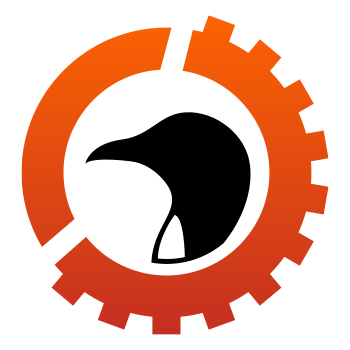

# Website do angolanOS (aOS) 🇦🇴

<p align="center">
  
</p>

Website oficial do **angolanOS (aOS)** — a Distribuição GNU/Linux Soberana da República de Angola,
um programa do **Instituto Superior de Angola (ISA)** apoiado pela **FUNDECIT** (Edital N.º 1/2026).

O código do sistema operativo vive no repositório
[`projecto_angolanOS`](https://github.com/Instituto-Superior-de-Angola/projecto_angolanOS).
Este repositório contém apenas o sítio institucional.

---

## 🧱 Tecnologia

| Camada | Escolha |
| --- | --- |
| Framework | Next.js 15 (App Router) |
| Linguagem | TypeScript em modo estrito |
| Estilo | Tailwind CSS 3 |
| Ícones | lucide-react |
| Alojamento | Vercel |

O conteúdo editorial (edições, lançamentos, roteiro, línguas) está em módulos de dados
tipados dentro de [`lib/`](lib/), separado da apresentação. Para actualizar o site na maior
parte dos casos basta editar um desses ficheiros.

---

## 🚀 Desenvolvimento local

```bash
npm install
npm run dev      # http://localhost:3000
```

## 🔍 Validação

Corra a verificação completa antes de abrir um Pull Request — é exactamente o que o CI executa:

```bash
npm run verificar
```

| Comando | O que valida |
| --- | --- |
| `npm run tipos` | Verificação de tipos TypeScript |
| `npm run lint` | Regras de ESLint e Next.js |
| `npm run verificar:marca` | Paleta e logotipo conformes com a identidade institucional |
| `npm run verificar:segredos` | Nenhuma chave, credencial ou token no código |
| `npm run build` | Build de produção |

---

## 🎨 Identidade visual

A paleta é **amostrada directamente do logotipo oficial** e não pode ser alterada sem decisão
institucional. Está declarada em dois sítios, que o CI obriga a manter sincronizados:
[`lib/marca.ts`](lib/marca.ts) e [`tailwind.config.js`](tailwind.config.js).

| Token | Valor | Uso |
| --- | --- | --- |
| `aos-laranja` | `#F35B07` | Acento primário — topo do gradiente da engrenagem |
| `aos-vermelho` | `#C9331E` | Acento secundário — base do gradiente |
| `aos-ouro` | `#E8B21E` | Dourado da bandeira nacional, com parcimónia |
| `aos-preto` | `#0B0B0C` | Silhueta do logotipo e superfícies escuras |

O gradiente canónico (`bg-gradiente-aos`) segue a mesma direcção do logotipo: 135°, de laranja
a vermelho. O símbolo nunca é recolorido, distorcido nem redesenhado — use sempre
`public/logo-aos.png`.

Introduzir uma cor hexadecimal fora desta paleta em `app/` ou `components/` faz o CI falhar.

---

## 🔄 CI/CD

Três workflows do GitHub Actions, todos em [`.github/workflows/`](.github/workflows/):

| Workflow | Gatilho | Efeito |
| --- | --- | --- |
| **Verificação Contínua** | Todos os pushes e Pull Requests | Tipos, lint, build, identidade visual, segredos e auditoria de dependências |
| **Pré-visualização** | Pull Request para `main` | Publica uma pré-visualização no Vercel e comenta o endereço no PR |
| **Publicação em Produção** | Verificação Contínua concluída com sucesso em `main` | Publica em produção no Vercel |

O fluxo é, portanto: **abrir PR → pré-visualização automática → revisão → merge em `main` →
publicação automática em produção**. Não há publicação manual no caminho normal, e nada é
publicado sem passar no portão de qualidade.

### Segredos necessários no repositório

| Segredo | Origem |
| --- | --- |
| `VERCEL_TOKEN` | Vercel → Account Settings → Tokens |
| `VERCEL_ORG_ID` | `.vercel/project.json` após `vercel link` |
| `VERCEL_PROJECT_ID` | `.vercel/project.json` após `vercel link` |

---

## 🤝 Contribuir

Aplicam-se as regras do projecto principal, incluindo o padrão de
[Conventional Commits em português](https://github.com/Instituto-Superior-de-Angola/projecto_angolanOS/blob/main/CONTRIBUTING.md):

```
<tipo>(<escopo>): <Descrição Curta>
```

Escopos habituais neste repositório: `site`, `conteudo`, `marca`, `ci`, `deps`.

---

## 📄 Licença

O conteúdo e o código deste sítio seguem a licença do programa aOS (GPL-3.0), salvo indicação
em contrário. O logotipo do angolanOS é marca institucional do Instituto Superior de Angola e o
seu uso fora do projecto carece de autorização.

---

**Instituto Superior de Angola (ISA)**
*Ciência, Inovação e Soberania Digital.*
